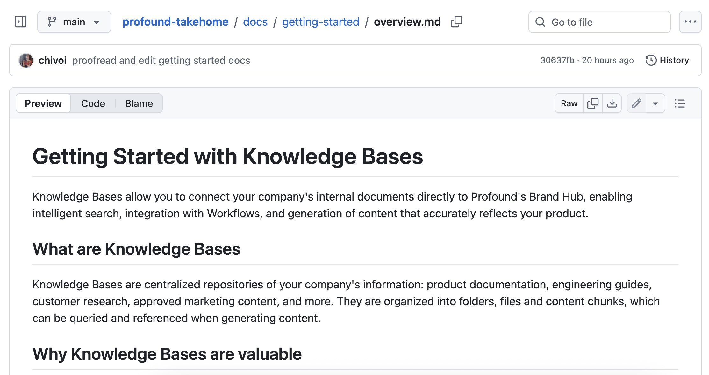
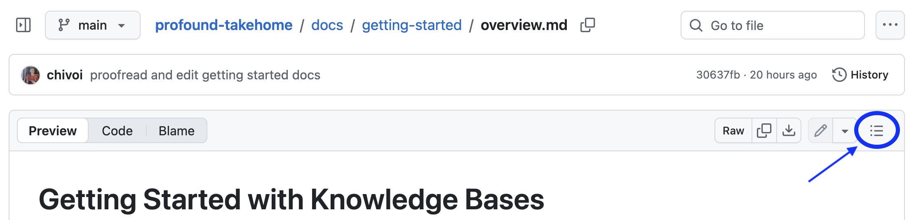
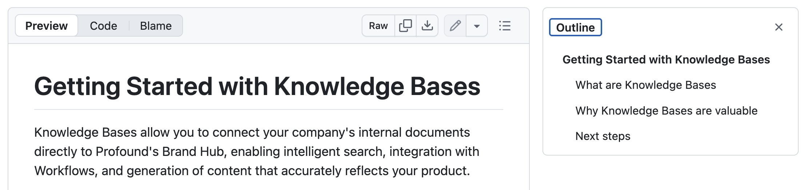
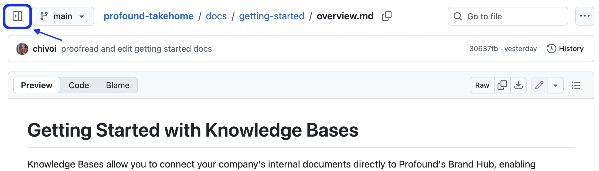
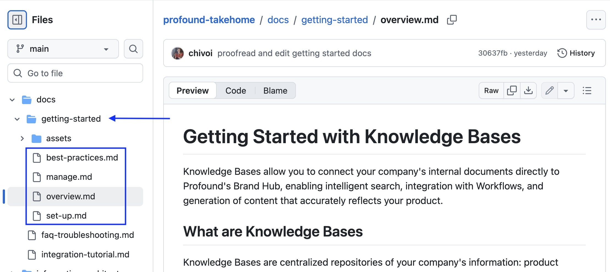

# Profound Technical Writer Take-Home Project

## Overview

This is a take-home challenge submission for the Technical Writer role at Profound.

It contains:

- [Information Architecture](./information-architecture/instructions-rationale.md) of the Knowledge Base feature
- [Getting Started](./docs/getting-started/overview.md) documentation for the feature
- A piece of choice: [Workflow Integration Tutorial](./docs/integration-tutorial.md)

## How to View This Work

The documents are written in Markdown format, so the simplest way to view them as they would appear on the public documentation site is directly on GitHub:

- Head to the [submission repository](https://github.com/chivoi/profound-takehome)
- Navigate to the `/docs` folder for the documentation files, and to the `/information-architecture` folder for the architecture diagram and writeup.
- When you click on a file, a formatted version of it appears directly in your browser.

### Tables of Contents

Pylon, used by Profound, seems to support document outlines natively, and so does GitHub, so I chose not to include any tables of contents in my submission documents. To view the content outline for each document, you can click on the outline icon on the top right of the document view.

To conveniently switch between files, you can expand the file tree by clicking the file tree icon on the right of the document view.

## Notes

### Assumptions & Missing Details

The contents of these documents are based on the screenshots I received in the test assignment spec, other Profound features, Profound knowledge bases, as well as competitor analysis (seeing what other companies are doing for similar features).

Given the time constraints and limited familiarity with the Profound product, I allowed myself to make some assumptions in the documentation, such as:

- The Knowledge Base setup guide is based on the generally adopted integration pattern in SaaS companies
- The file storage limit allocation was assumed based on common pricing models and Profound's pricing model for other features
- Other assumptions about file tagging UI, how the Knowledge Base Search works, etc.

Also, some documents are not as detailed as I prefer my documents to be. Some examples:

- The Integration Tutorial is missing details about selecting search results when integrating information from Knowledge Bases to Workflows, because I wasn't sure how that would work and did not want to assume and invent the entire UI experience.
- The Integration Tutorial's "Create Workflow" step includes the suggested steps but does not give a concrete example of a functioning workflow with extensive details like the exact prompts, etc. The reason for this is the limited time I could spend familiarizing myself with Workflows: I did try to put a Workflow together with some mock steps, but with my limited familiarity with the domain, I wasn't sure if my example would be good enough to be useful for a hypothetical reader.

In real work conditions, I would certainly avoid assumptions and missing details by testing the in-development feature using a test account, clarifying what I don't know with Engineering, Marketing, Sales, or other teams, or sitting down with Product Owners to figure out the best use cases for features before including them in the customer-facing tutorials.

### Screenshots: File Names & Styling

When viewing the files, you will notice that the arrows and highlights on the screenshots are not completely stylistically unified. Also, the filenames for the Getting Started guide images do not have descriptive names.

This is a tradeoff I had to make to submit the assignment quickly: the perfecting styling and naming task was deemed non-crucial and de-prioritized.

### Next Steps Sections

There is a **Next steps** section on every page of the Getting Started guide.

Such sections are normally auto-generated components supported by knowledge base site providers or generators. However, I chose to keep them in my submission docs for signposting purposes, as well as to provide actionable steps that give the user the "I can do this" feeling.

### Questions

If you have any questions about viewing my work, please feel free to contact me on ana.lastoviria(at)gmail.com.

Happy viewing!

___

Built by Ana Lastoviria
