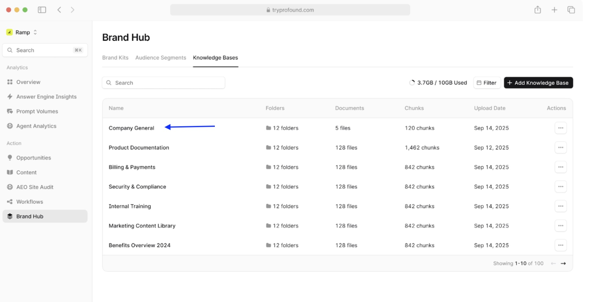
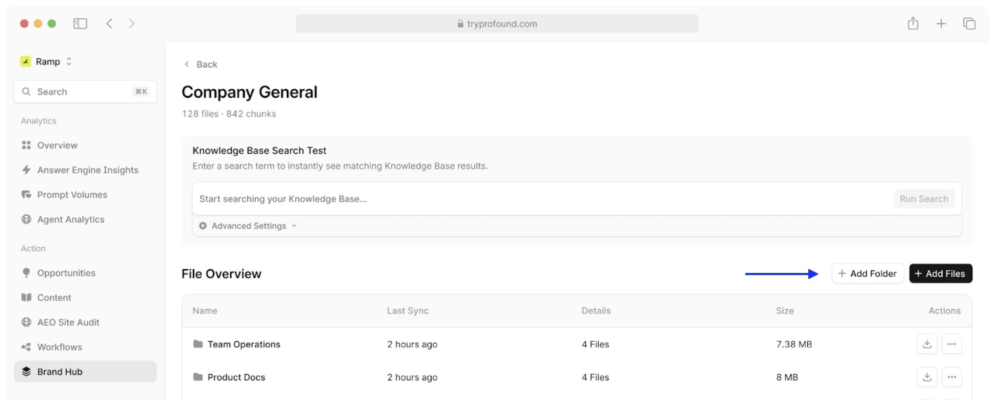
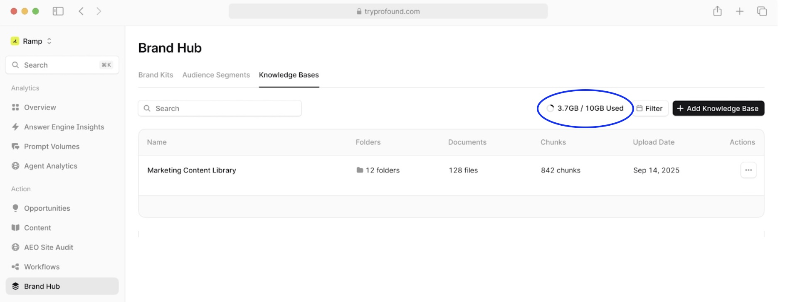
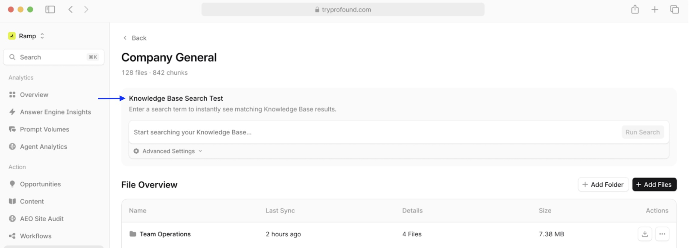
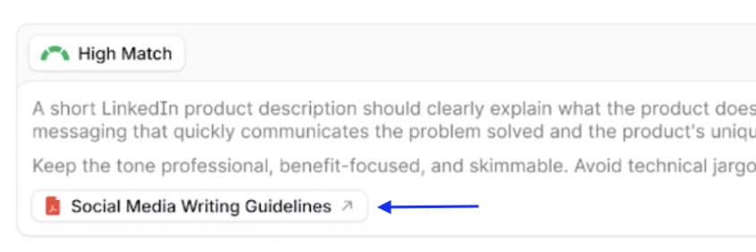
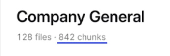

# Managing Knowledge Bases

## Organizing content with folders and files

### Adding folders and files

1. Select a Knowledge Base from the list, click on its name.

2. Click **Add Folder** to create a new folder.
3. Click **Add Files** to upload documents directly.

Supported file types include PDF, DOCX, TXT, and other common file formats.

### Managing files

#### File Overview table

In the File Overview table, you can see the following data:

- **Name**: Folder or file name
- **Last Sync**: When content was last updated
- **Details**: Number of files in folders or tags for individual files
- **Size**: Storage space used
- **Actions**: Download or manage individual items

#### File tagging

Files can be assigned tags to help with categorization and search.

When you sync your Knowledge Base, some tags are added to your existing files automatically based on the file content. You can edit or add tags by clicking on the individual files and following the prompts.

When adding custom tags, make sure to use clear, descriptive tag names (e.g., "Onboarding", "Guide", "HR", etc.) for the best results.

Multiple tags can be added to the same file, and multiple files can have the same tags.

### Understanding storage limits

Based on your Profound plan, your workspace includes a certain amount of storage for Knowledge Bases. The default storage allocation on a Starter plan is 10GB. If you need more, you can talk to your sales representative or contact our sales team using [the contact form](https://www.tryprofound.com/contact-sales) to explore your options.

You can keep track of your storage usage in the **Brand Hub > Knowledge Bases** tab, where it is displayed (e.g., 3.7GB/10GB Used) just above the Knowledge Bases list:

## Searching your Knowledge Base

The Knowledge Base Search Test feature lets you query your content before using it in Workflows, helping you verify that relevant information is indexed correctly.

### Running a search

1. Open any Knowledge Base.
2. In the **Knowledge Base Search Test** section, enter your query.
3. Click **Run Search** or press Enter.
4. Click **Advanced Settings** to refine your search parameters if needed.
5. Review results ranked by relevance.

### Understanding search results

Search results are organized by match quality.

**High Match** results directly answer your query, while **Medium Match** results are partially relevant, and **Low Match** results are only loosely related to your search terms.

Each result includes a source document name and folder, relevant text excerpt with the page number, as well as a "Show more" option to view extended context. To view the entire document that includes your search term, click on the document file name.

>[!TIP]
>Be specific in your search queries: "LinkedIn product description guidelines" returns better results than "social media". Try a few different phrasings to see which ones yield the best results.

### What are chunks?

When you upload files to a Knowledge Base, Profound automatically processes them into chunks.

**Chunks** are small segments of meaningful text within a file. For example, a 50-page product documentation PDF might be broken into 200 chunks, with each chunk containing a specific section like a feature description, pricing table, or integration guide.

Chunking is what allows the Knowledge Base search results to point to the exact relevant piece of text rather than an entire document, making it faster to find specific information.

## Using Knowledge Base content in Workflows

Knowledge Bases integrate seamlessly with Profound's Workflows, allowing you to automatically incorporate company information into AI-generated content.

Here's how to reference your Knowledge Base in a content creation Workflow:

1. **Create or edit a Workflow**. A detailed guide on how to do this can be found [in our Workflows documentation](https://profound-knowledge-base.help.usepylon.com/articles/2212787792-create-a-Workflow).
2. **Add a Use Knowledge Base step**:
   - In the Workflow Editor, add a **Use Knowledge Base** action before the actions that you need the information for
   - Select which Knowledge Base to use
   - Enter your query
   - Label the output with a descriptive variable name
3. **Reference the output** in the later Workflow steps by referencing its output variable name

>[!TIP]
> For a more detailed example of how to integrate your Knowledge Base into a Workflow, check out our [Integrating a Knowledge Base into a Workflow tutorial](../integration-tutorial.md)

## Next steps

- Learn [best practices for structuring your Knowledge Base](./best-practices.md)
- Follow the [integration tutorial](../integration-tutorial.md) to integrate a Knowledge Base into a Workflow
- Visit the [FAQ & Troubleshooting](../faq-troubleshooting.md) section
