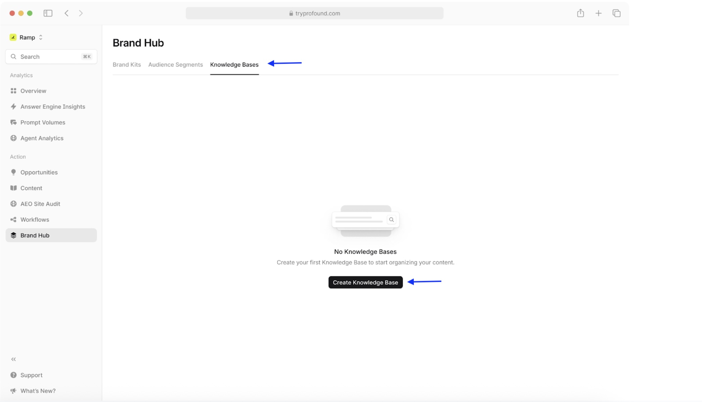
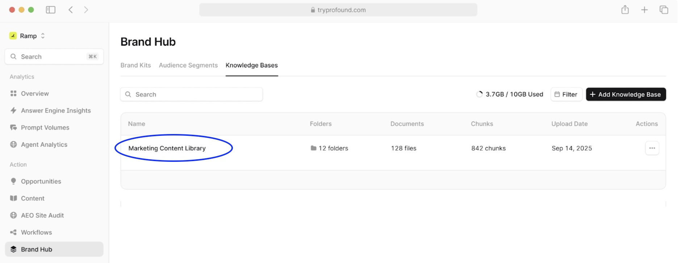
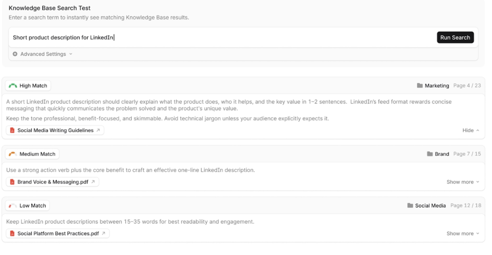

# Getting Started with Knowledge Bases

Knowledge Bases allow you to connect your company's internal documents directly to Profound's Brand Hub, enabling intelligent search, integration with Workflows, generation of content that accurately reflects your product.

## Overview

### What are Knowledge Bases

Knowledge Bases are centralized repositories of your company's information: product documentation, engineering guides, customer research, approved marketing content, and more. All of those that can be queried and referenced when generating AI-optimized content.

### Why Knowledge Bases are valuable

While Brand Kits define *how* your brand communicates: your tone, voice, writing style, Knowledge Bases provide the *what*: the actual facts, data, and proprietary information your content needs to be accurate and authoritative.

Knowledge bases empower your team to:

- **Ground AI content in facts, not hallucinations**: Your content can sound perfectly on-brand but still contain incorrect product specs, outdated pricing, or made-up statistics. Knowledge Bases solve this by letting you search for exact information, like your company's enterprise pricing model, or a customer success metrics for financial services, and pull verified and approved data directly into generated content.

- **Leverage proprietary insights competitors can't access**: Your competitive advantages, internal research, customer insights, and product roadmaps don't exist on the public web. Knowledge Bases give Workflows access to this proprietary content, enabling you to create authoritative content that stands out in AI search results because it's backed by unique data only you possess.

- **Update once, propagate everywhere**: Organize content into folders like "Product Documentation" and "Competitive Intelligence," then let workflows query them automatically. When your product team updates a feature spec or your research team publishes new customer insights, every future workflow pulls the latest information. No more manually updating dozens of content briefs or finding outdated claims in published articles.

- **Eliminate the research bottleneck**: Instead of digging through Google Drive, SharePoint, and Slack threads hunting for that customer quote or ROI stat, search your Knowledge Base with natural language queries like *"testimonials from healthcare customers"* and instantly surface the exact excerpt, complete with source document and page number. This transforms hours of research into seconds, freeing your team to focus on strategy and innovation.

## Setting up your first Knowledge Base

### Prerequisites

To connect your first Knowledge Base, you will need:

- A Profound account (visit our [Platform User Guide](https://profound-knowledge-base.help.usepylon.com/articles/9085149197-user-guide#getting-started) to learn how to set it up),
- Access to the data source you want to connect (Google Drive, SharePoint, etc.)
- Relevant documents prepared and organized in your source system (please refer to our suggested [best practices of structuring your Knowledge Base](#folder-structure-best-practices)).

### Creating a Knowledge Base

1. Navigate to **Brand Hub** in the left sidebar
2. Click the **Knowledge Bases** tab
3. Click the **Create Knowledge Base** button

4. Enter a descriptive name (e.g., "Product Documentation" or "Marketing Content Library") and description for your Knowledge Base
5. Select your data source (Google Drive, SharePoint, etc.) from the available integrations
6. Follow the prompts through the authentication flow and grant Profound necessary permissions to access your data
7. Choose which folders or files to sync
8. Click **Create**

After that, Profound will begin syncing your content. Depending on the size of your Knowledge Base, this may take a few minutes to several hours. Once the sync is done, you will see you Knowledge Base on the list.

### Understanding storage limits

Based on your Profound plan, your workspace includes a certain amount of storage for Knowledge Bases. The default storage allocation on a Starter plan is 10GB. If you need more, you can talk to your sales representative or contact our sales team using [the contact form](https://www.tryprofound.com/contact-sales) to explore your options.

You can keep track of your storage usage in the **Brand Hub > Knowledge Bases** tab, where it is displayed(e.g. 3.7GB/10GB Used) just above the Knowledge Bases list:

## Organizing content with folders

After connecting your Knowledge Base to your Brand Hub, you can manage the files and folders within the base.

### Adding folders and files

1. Select a Knowledge base from the list, click on it's name.

2. Click **Add Folder** to create a new folder
3. Click **Add Files** to upload documents directly

Supported file types include PDF, DOCX, TXT, and other common file formats.

### Managing files

#### File Overview Table

In the File Overview table you can see following data:

- **Name**: Folder or file name
- **Last Sync**: When content was last updated
- **Details**: Number of files in folders, or tags for individual files
- **Size**: Storage space used
- **Actions**: Download or manage individual items

#### File tagging

Files can be assigned tags to help with categorization and search.

When you sync your knowledge base, some tags are added to your existing files automatically, based on the file content. You can edit / add tags by clicking on the individual files and following the prompts.

When adding custom tags, make sure to use clear, descriptive tag names (e.g., "Onboarding," "Guide", "HR", etc.) for the best results.

Multiple tags can be added to the same file, and multiple files can have the same tags.

## Searching your Knowledge Base

The Knowledge Base Search Test feature lets you query your content before using it in workflows, helping you verify that relevant information is indexed correctly.

### Running a search

1. Open any Knowledge Base
2. In the **Knowledge Base Search Test** section, enter your query
3. Click **Run Search** or press Enter
4. Click **Advanced Settings** to refine your search parameters if needed
5. Review results ranked by relevance

### Understanding search results

Search results are organized by match quality.

**High Match** results directly answer your query, while **Medium Match** ones are partially relevant, and **Low Match** ones are only loosely related to your search terms.

Each result includes a source document name and folder, relevant text excerpt with the page number, as well as a "Show more" option to view extended context. To view the entire document that includes your search term, click on the document file name.

>[!TIP]
>Be specific in your search queries: *"LinkedIn product description guidelines"* returns better results than *"social media"*. Try a few different phrasings to see which ones yield the best results.

## Using Knowledge Base content in Workflows

Knowledge Bases integrate seamlessly with Profound's Workflows, allowing you to automatically incorporate company information into AI-generated content.

>[!TIP]
>If you are new to Workflows, have a look at our [Workflows documentation](https://profound-knowledge-base.help.usepylon.com/collections/1956844252-workflows) to learn how to get started with them.

### Integrating a Knowledge Base into a Workflow

Here's how to reference your Knowledge Base in a content creation workflow:

1. **Create or edit a workflow**. A detailed guide on how to do it can be found [in our Workflows documentation](https://profound-knowledge-base.help.usepylon.com/articles/2212787792-create-a-workflow).
2. **Add a Use Knowledge Base step**
   - In the workflow builder, add a **"Use Knowledge Base"** action directly before the action that you need information for
   - Select which Knowledge Base to use
   - Enter your query
   - Label the output with a descriptive variable name
3. **Reference the output**:
   - Use the output in the later workflow steps by referencing it's output variable name
   - Learn more about [using variables in Workflow steps](https://profound-knowledge-base.help.usepylon.com/articles/2212787792-create-a-workflow#use-variables-in-steps)

>[!TIP]
> For a more detailed example of how to integrate your Knowledge Base into a Workflow, check out our [Integration Tutorial](./integration-tutorial.md)

### Tips for effective integration

- **Query strategically**: Be specific about what information you need at each workflow step
- **Combine sources**: Use multiple Knowledge Bases in the same workflow (e.g., product docs + brand guidelines)
- **Add human checkpoints**: Always review AI-generated content that references your Knowledge Base
- **Iterate queries**: If results aren't relevant, refine your Knowledge Base query

