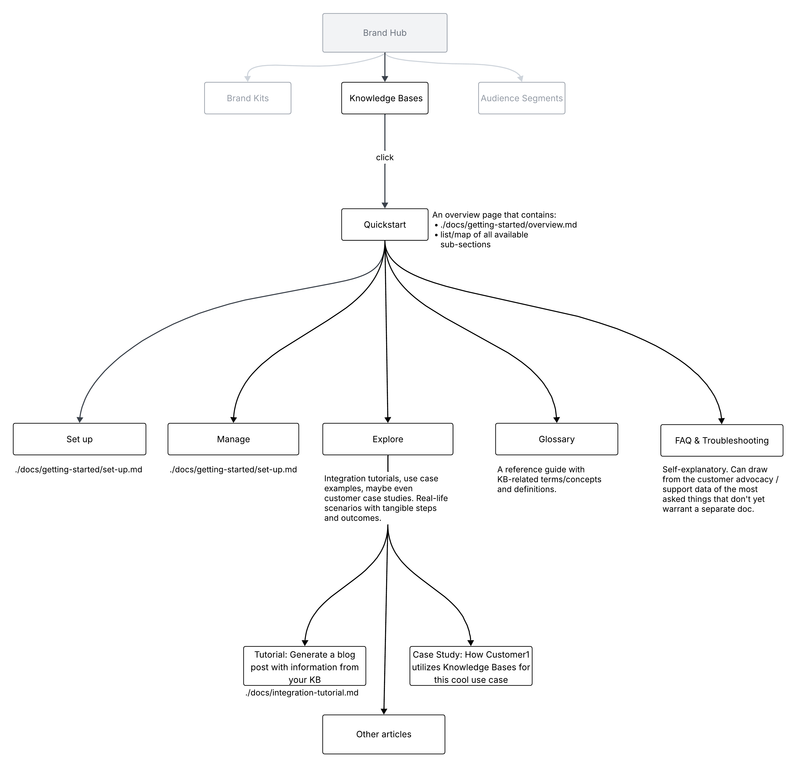
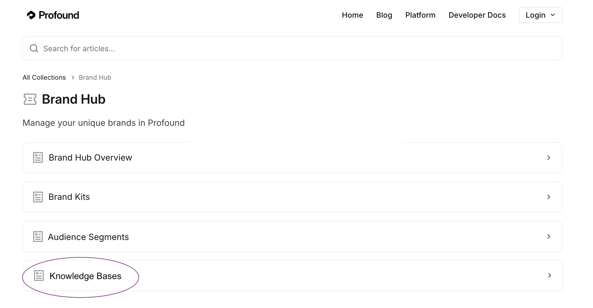

# Knowledge Bases feature Information Architecture

## Diagram

The diagram is [available to view on Lucid app](https://lucid.app/lucidspark/1c011e1e-afc5-4c57-8edc-d97ede5d79b7/edit?viewport_loc=-1693%2C-731%2C4628%2C2361%2C0_0&invitationId=inv_7f6f0b0f-bb2d-4e86-ba55-bae4ee4e0a2b).

## How to read this diagram

Knowledge Bases feature here is embedded into an existing documentation structure, along with Brand Kits and Audience Segments.
The existing sections are displayed in gray, whereas the new sections are displayed in black.
Under each article is a text note: either the filepath of the full document provided in the submission directory (e.g., ./docs/getting-started/set-up.md for the Set Up Guide), or a short description of the article contents.

## Minor changes to existing UI copy

I dropped the "Create and manage <feature_name>" wording to make headings more lean and flexible to accommodate the extended information structure in the KB section. The offered architecture contains articles not only on creating and managing KBs, but also troubleshooting, use cases, tutorials, etc.

## Structure Rationale

The structure of the KB section I'm suggesting is slightly different from the existing pattern in Profound docs:

- The information is split into more **granular, task-based sections**: Set Up, Manage, Explore, etc. This approach avoids overwhelming the reader and makes the docs more skimmable for both human readers and potentially AI to find what they need ASAP.
- The structure is informed by the current state of the Profound product but also allows for **scalability**. The semantic [diataxis](https://diataxis.fr/)-inspired separation of concerns will make it easy to expand current articles into multi-article sections and create new sections as the product grows. For example, FAQ & Troubleshooting can become a "Get Help" section split into separate FAQ and Troubleshooting articles once the text volumes warrant it.
